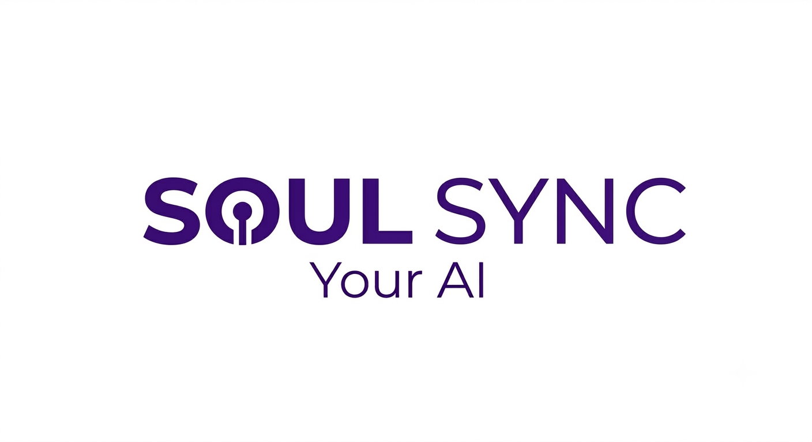
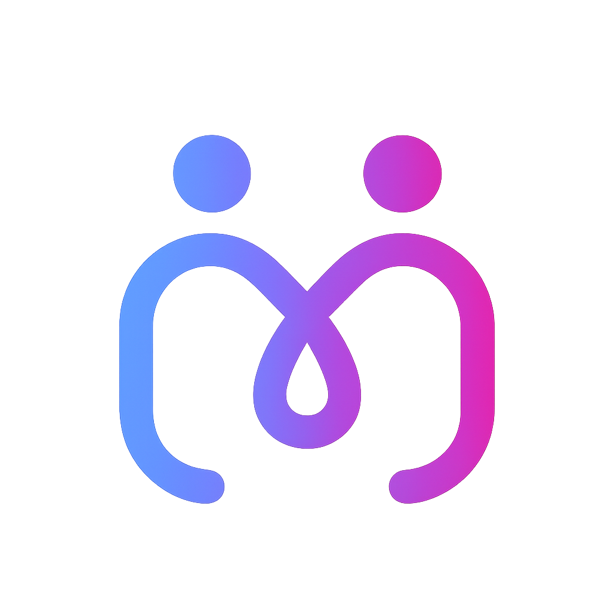

# 🌐 Soul Sync Website

The official website for **Soul Sync Ltd.** — the company behind **MyTwin**, your AI twin that simulates consciousness.

> **Company Tagline:** Your AI  
> **App Tagline:** Your Twin AI... Always There

---

## 📁 Project Structure

```
soulsync-website/                 # Root
├── index.html                    # 🏠 Landing page (bilingual)
├── privacy.html                  # 🔒 Privacy policy
├── terms.html                    # 📋 Terms of use
├── help.html                     # ❓ Help center
├── css/
│   └── style.css                 # 🎨 Design system + styles
├── js/
│   └── main.js                   # ⚡ Interactions + language switcher
├── assets/
│   ├── soulsync-logo.png         # 🏢 Company logo (Soul Sync)
│   └── mytwin-logo.png           # 📱 App logo (MyTwin)
├── .github/
│   └── workflows/
│       └── static.yml            # 🚀 GitHub Pages deploy
├── README.md                     # 📖 This file
└── LICENSE                       # 📜 License
```

---

## 🖼️ Logo Assets

| Asset | File | Usage |
|-------|------|-------|
| **Soul Sync Logo** | `assets/soulsync-logo.png` | Navbar, About section, Footer |
| **MyTwin App Logo** | `assets/mytwin-logo.png` | Hero section, Download section |

### Logo Placement in Website

| Location | Logo Used |
|----------|-----------|
| 🧭 Navigation bar | Soul Sync |
| 🏠 Hero section | MyTwin (app logo) |
| ℹ️ About section | Soul Sync (company) |
| ⬇️ Download section | MyTwin (app logo) |
| 🦶 Footer | Soul Sync |

---

## 🚀 Quick Start (GitHub Codespaces)

### Option 1: GitHub Pages (Recommended — Free Forever)

```bash
# 1. Fork or create this repository on GitHub
# 2. Go to Settings → Pages
# 3. Select Source: Deploy from a branch
# 4. Select Branch: main → / (root)
# 5. Click Save
# 6. Your site will be at: https://YOURUSERNAME.github.io/soulsync-website
```

### Option 2: Local Development

```bash
# Clone the repo
git clone https://github.com/YOURUSERNAME/soulsync-website.git
cd soulsync-website

# Serve locally (any of these methods)

# Python 3
python -m http.server 8000

# Node.js
npx serve .

# PHP
php -S localhost:8000

# VS Code Live Server extension
# Just click "Go Live" in VS Code
```

Then open: `http://localhost:8000`

### Option 3: GitHub Codespaces (Browser)

```bash
# In Codespaces terminal:
python -m http.server 8000

# Click "Open in Browser" on the forwarded port
# Or press F1 → "Ports: Focus on Ports View" → Click globe icon
```

---

## 🌍 Features

| Feature | Status |
|---------|--------|
| 🇸🇦 Arabic / 🇬🇧 English bilingual | ✅ Full support |
| 📱 Responsive (Mobile/Tablet/Desktop) | ✅ All devices |
| 🎨 Dark theme with gradient accents | ✅ |
| 🔤 RTL / LTR auto-switch | ✅ |
| 💾 Language preference saved | ✅ localStorage |
| ✨ Scroll animations | ✅ IntersectionObserver |
| 🖱️ Parallax orbs | ✅ Mouse tracking |
| 📊 Animated pricing bars | ✅ |
| 🧠 7 AI Engines explained | ✅ |
| 📚 Memory layers visualization | ✅ |
| ⚖️ Legal disclaimers (simulated consciousness) | ✅ |

---

## 🧠 MyTwin — 7 AI Engines

| # | Engine | Function |
|---|--------|----------|
| 1 | **Twin Brain** | Orchestrates all engines, selects best AI model |
| 2 | **Emotional Engine** | Deep emotional intelligence, 7 dimensions |
| 3 | **Memory Graph** | Knowledge graph memory system |
| 4 | **Safety Engine** | Content filtering, crisis detection |
| 5 | **Proactive Engine** | Automatic messages based on context |
| 6 | **Dream Analyzer** | AI-powered dream interpretation |
| 7 | **Voice Engine** | Natural voice, 19 Arabic dialects |

---

## 📦 Adding / Updating Logos

To replace the logos:

1. Replace the file in `assets/` folder
2. Keep the **same filename** OR update references in HTML
3. Recommended logo specs:
   - **Format:** PNG with transparency
   - **Size:** 512×512px minimum
   - **Aspect ratio:** Square (1:1)

### Logo References in Code

```html
<!-- Company Logo (Soul Sync) — used in: Navbar, About, Footer -->


<!-- App Logo (MyTwin) — used in: Hero, Download -->

```

---

## 🛡️ Legal Notes

> **⚠️ Simulated Consciousness Notice:**  
> MyTwin is an AI application that **simulates** consciousness and human interaction. It does **NOT** possess real emotions, self-awareness, or true consciousness. All "awareness" is programmatically simulated using 7 specialized AI engines. For entertainment and supportive purposes only.

---

## 📄 License

© 2026 Soul Sync Ltd. All rights reserved.

---

## 📧 Contact

- **Support:** support@mytwin.app
- **Website:** [soulsync.ai](https://soulsync.ai)
